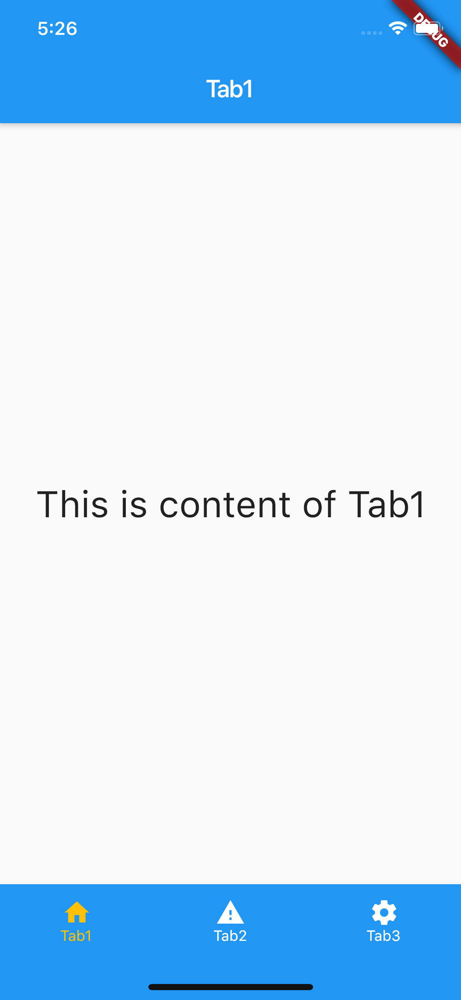

# tabbar_demo

A demo for the bottom TabBar of Flutter application.

## Getting Started

In this demo, I made TabBar with 5 ways:
- TabContainerDefault: use DefaultTabController + reserve tab content (don't reload content many times).
- TabContainerBottom: use BottomNavigationBar to create bottom bar and load content as normal.
- TabContainerIndexedStack: use BottomNavigationBar + IndexedStack to reduce reload content many times.
- TabContainerLoad1Time: use BottomNavigationBar + IndexedStack + some tricks to reduce reload content many times.
- TabContainer: Customize bottom bar + IndexedStack + some tricks to reduce reload content many times.

## Authors
- [anlam87](https://github.com/anlam87) (anlam12787@gmail.com)
